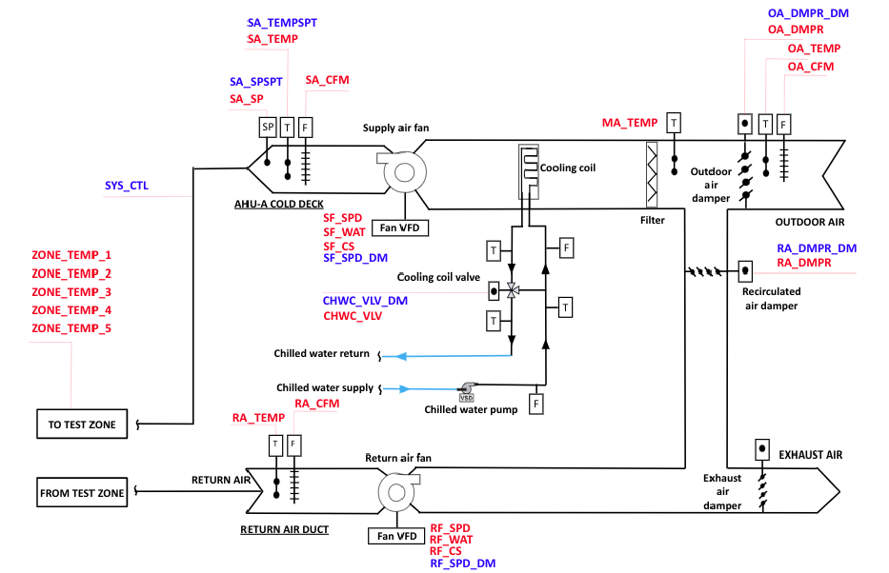
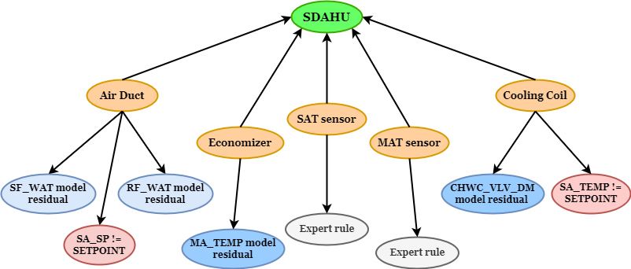
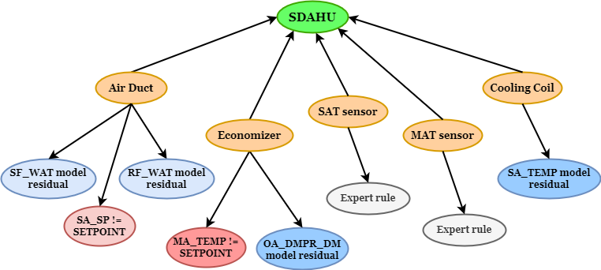

# Novel hybrid FDD framework based on Bayesian Networks in building HVAC systems

## Indice
1. [Introduzione](#introduzione)
2. [Descrizione del caso studio](#descrizione-del-caso-studio)
3. [Descrizione del dataset](#descrizione-del-caso-studio)
4. [Definizione dei modelli di baseline](#definizione-dei-modelli-di-baseline)
5. [Definizione delle Bayesian Networks (struttura e probabilità)](#definizione-delle-bayesian-networks-struttura-e-probabilità)
6. [Post-processing for fault Detection and Isolation](#post-processing-for-fault-detection-and-isolation)
7. [Conclusioni](#conclusioni)

---

## Introduzione
In questa repository è possibile visionare il framework seguito per definire un processo ibrido di FDD basato su Bayesian Networks (BNs).
Per informazioni più dettagliate, è possibile consultare l'articolo di riferimento: [Novel hybrid FDD framework based on Bayesian Networks in building HVAC systems]().

---

## Descrizione del caso studio
Il caso studio riguarda un'UTA a condotto singolo (Single-Duct Air Handling Unit - SDAHU), i cui componenti principali includono ventilatori di mandata e ripresa con inverter, una batteria di raffreddamento, una valvola di controllo della batteria di raffreddamento e serrande per l'aria esterna, l’aria di espulsione e l’aria di ripresa.
L'unità SDAHU è controllata per mantenere il set-point della temperatura dell’aria di mandata quando la batteria di raffreddamento è attiva. In caso contrario, mantiene il set-point della temperatura dell’aria di mix modulando le serrande dell’economizzatore.
I guasti analizzati sono relativi alla valvola della batteria di raffreddamento bloccata, alla serranda dell’aria esterna bloccata e al sensore della temperatura dell'aria di mandata con offset. Ogni categoria di guasto presenta 4 diversi livelli di severity, per un totale di 12 guasti distinti.

Il layout dell'impianto e le variabili monitorate sono riportate nella seguente immagine:

- Maggiori dettagli: [Informazioni specifiche SDAHU (sviluppato da LBNL)](https://dx.doi.org/10.25984/1881324)

---

## Descrizione dei dati simulati
I dataset, in formato .csv, contenuti all'interno della cartella _data/preprocessed_data_ sono già stati preprocessati.
In particolare, sono stati rimossi dalle successive analisi specifici periodi temporali, tra cui:
- Inattività del sistema.
- Fasi di transizione tra due diverse modalità operative.
- Transitori.

In questo lavoro sono stati adottati tre approcci differenti, ciascuno rappresentante un diverso livello di conoscenza sul funzionamento del sistema HVAC.
I tre scenari considerati sono i seguenti:
- Scenario 1: conoscenza limitata del sistema
- Scenario 2: conoscenza completa del sistema e delle logiche di controllo
- Scenario 3: conoscenza completa del sistema e delle logiche di controllo unita all'accesso della ground truth

Dopo aver etichettato i dati normali presenti in tutti i file .csv disponibili, ciascun dataset è stato suddiviso assegnando la prima settimana di ogni mese dell’anno al set di test, mentre le settimane rimanenti sono state suddivise tra training e validation con un rapporto 80%-20% (_splitting_data.py_).

Le etichette dei dati relativi ai guasti, anch’essi presenti nei file .csv, sono stati invece classificati e raggruppati in base al componente coinvolto.

---

## Definizione dei modelli di baseline
La baseline è stata definita utilizzando diversi modelli Random Forest (RF).
In particolare, sono stati impiegati modelli RF di regressione per costruire un riferimento affidabile e robusto in condizioni prive di guasti.
Alcune variabili operative chiave sono state selezionate come variabili target in modelli separati, mentre un sottoinsieme delle restanti variabili relative al sistema è stato utilizzato come input.
Le variabili esogene, come le condizioni climatiche, sono state impiegate esclusivamente come variabili di ingresso.

I residui generati dai modelli RF addestrati sono stati utilizzati come **evidenze virtuali** nel successivo algoritmo basato su BN per la rilevazione e l’isolamento dei guasti.
Le evidenze virtuali rappresentano condizioni incerte e possono essere ottenute dai residui dei modelli di stima (baseline).
Assumendo che i residui seguano una distribuzione gaussiana, le deviazioni tra i valori reali e quelli stimati possono essere trasformate in valori di probabilità di guasto compresi tra 0 (normal) e 1 (fault).
Questi valori probabilistici sono stati poi utilizzati per aggiornare la probabilità di specifici nodi della rete bayesiana.

---

## Definizione delle Bayesian Networks (struttura e probabilità)
L’architettura della BN è stata definita a partire da un modello semantico basato su ontologia, utilizzando Brick.
Questo schema semantico fornisce una descrizione dettagliata dei componenti HVAC e dei sensori associati a ciascun componente.
La struttura iniziale della rete è stata successivamente affinata, integrando conoscenze di dominio.
Tale processo ha permesso di eliminare variabili monitorate ridondanti e di aggiungere nodi supplementari, utili a rappresentare regole esperte o specifici KPI.
Inoltre, i sensori che misurano variabili controllate (come la temperatura dell’aria di mandata e quella dell’aria di mix) sono stati aggiunti.
In seguito si riportano le due strutture delle BN, in base alla rispettiva modalità operativa:
- **Cooling modes**

- **Economizing mode**

Per ogni nodo di guasto componente (in arancione) è stata assegnata una probabilità a priori pari a **0.1** (guasto) e **0.9** (normale).
Il nodo di guasto sistema HVAC (in verde) è stato definito secondo una regola deterministica di tipo **OR**: se almeno un componente è guasto, il sistema è considerato guasto (probabilità = 1); altrimenti, è considerato normale (probabilità = 0).
I nodi di evidenza, che rappresentano sintomi osservabili del sistema, sono stati collegati ai nodi di guasto attraverso dipendenze probabilistiche. Le probabilità condizionate assegnate ai nodi di evidenza variano in base alla natura e alla gravità dei sintomi osservati (knowledge-based).

---

## Post-processing for fault Detection and Isolation
La rete bayesiana sviluppata analizza continuamente il comportamento del sistema, aggiornando le previsioni di guasto ogni 15 minuti. Tuttavia, per garantire maggiore affidabilità, i risultati non vengono valutati a ogni singolo intervallo, ma aggregati e analizzati su base giornaliera.
In questa fase di post-processing, vengono applicate regole esperte per affinare i risultati, escludendo anomalie transitorie che potrebbero generare falsi allarmi. Queste regole tengono conto dei cambi di modalità operativa e delle interazioni gerarchiche tra guasti.

---

## Daily knowledge-driven fault Diagnosis
L’ultimo step del processo è dedicato alla diagnosi, completando il processo di rilevazione e isolamento con l’identificazione della tipologia e gravità del malfunzionamento individuato.
A differenza degli approcci supervisionati, che richiedono etichette di guasto predefinite, la metodologia adotta un approccio knowledge-driven, combinando regole esperte, semplici KPI e analisi statistiche. La diagnosi viene eseguita a fine giornata, una volta che i componenti guasti sono stati identificati.
Un esempio di diagnosi grafica, soltanto per lo Scenario 3, è riportata in _figs/diagnosis_scenario3_.

---

## Performance metrics
Le prestazioni dei modelli di baseline (_results/baseline_models_) sono state valutate utilizzando le seguenti metriche:
- MAE (Mean Absolute Error)
- MSE (Mean Squared Error)
- RMSE (Root Mean Squared Error)
- R2 (Coefficient of Determination)

La matrice di confusione è stata utilizzata per valutare le prestazioni della rilevazione dei guasti (_results/fault_detection_) e dell'isolamento dei guasti (_results/fault_isolation_).

---

## Conclusioni
Questo progetto offre un approccio ibrido alla FDD in sistemi HVAC.

Per ulteriori dettagli, non esitare a contattare il creatore [Marco Paolini](https://github.com/Paolini408).
